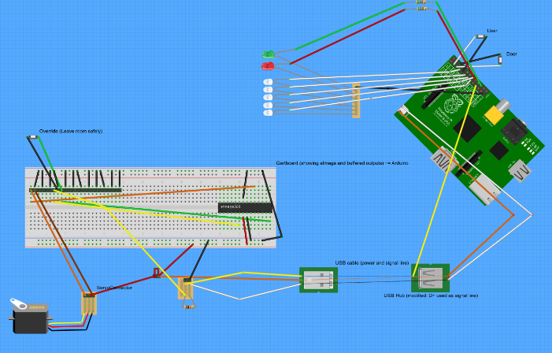

# room-defence-system
A Raspberry Pi, a Gertboard, a Pi Camera for face recognition and a giant Nerf Rifle!

This project works in conjunction with Tony DiCola's Raspberry Pi powered box which uses face recognition with OpenCV to lock and unlock itself. https://github.com/tdicola/pi-facerec-box 

The software depends on a particular hardware setup, which includes a Raspberry Pi camera, GPIO lines connected to buttons and LEDs. The complete system is able to protect a room by checking faces and activating defences when an unrecognised intruder is detected.

Intro video
https://www.youtube.com/watch?v=UiDus-EdKdw 

----

## Hardware Setup Summary

Take a look at the [Fritzing diagram](docs/NerfDoor.fzz) to get started.
  
My setup uses a Gertboard to control the servo-motor that pulls the Nerf gun trigger. The Gertboard has many functions - only the relevant bit is represented (by a breadboard) in the Fritzing file.
The ino file in [this folder](servoController/dtServoGun2) is the Atmega328 source code for activating the servo on receipt of a simple 3v3 signal from the Raspberry Pi. The code is suitable for Gertboard, Arduino and similar devices (e.g. Adafruit Pro Trinket 3v 12Mhz).  
It may have been simpler to tape the trigger and just switch power to the gun on and off, but I wanted the challenge of triggering the gun with a servo-motor. My servo is secured next to the Nerf gun trigger using Lego Technic. There are many other approaches that would work equally well.  
[Gordon @ Drogon](https://projects.drogon.net/raspberry-pi/gertboard/arduino-ide-installation-isp/) has produced some excellent material to help you when developing code for the Gertboard's Atmega328 chip.  
[Tony DiCola's pi-facerec-box project pages](https://github.com/tdicola/pi-facerec-box) link to other useful hardware resources. This room-defence-system project uses a different hardware setup, but depends on all the good work Toni put into harnessing OpenCV software for face recognition. Software setup is described below.

## Software Setup Instructions

Start by cloning this project to a convenient location on your Raspberry Pi (V1 model B, B+ or V2), and do a cd into the resulting folder:
```
git clone https://github.com/mech0s/room-defence-system 
cd room-defence-system
```    
Next, clone Tony DiCola's project to create a further sub-folder in which to carry out your face recognition training. The room-defence-system depends on the pi-facerec-box software being in this location.
```
git clone https://github.com/tdicola/pi-facerec-box
cd pi-facerec-box
git reset --hard 10f7f29ba08695c5b6ef79ff2b87503303350644
```
The "git reset" command will ensure you get the particular version (commit) that has been used (the latest commit at the time of writing). If at any point you want to get the very latest version of Toni's project, use "git pull".  

You are now ready to follow [Tony DiCola's instructions](https://learn.adafruit.com/raspberry-pi-face-recognition-treasure-box/software) for building and installing the required software. I built, installed and used OpenCV v2.4.10 successfully in my room-defence-system.

Follow Toni's OpenCV training and configuration guide.  
You can alter pi-facerec-box/config.py to change BUTTON_PIN from 25 to a more appropriate value (BUTTON_PIN = 2 allowed the user-panel button in my setup to be used to trigger training runs)
I also altered the POSITIVE_THRESHOLD value (to 3300.0) in order to make recognition of positive faces more likely.  

Once software has been built, installed, configured and trained you can run the room-defence-system using the script
```
sudo runSystem.sh
```
This could be run in a terminal, but would be best run under a ['screen'](http://www.gnu.org/software/screen/manual/screen.html) session (which can be detached later), or launched from /etc/rc.local at boot, or launched as a system service.
